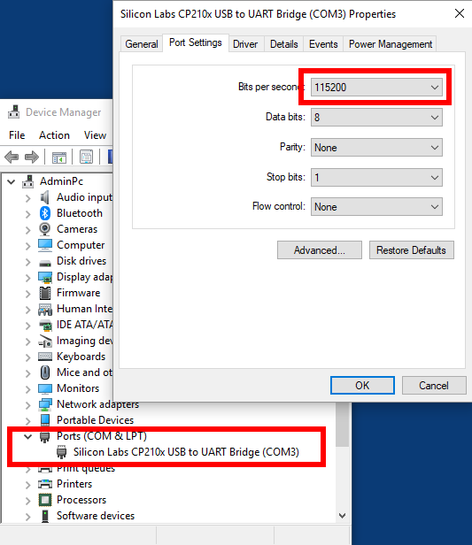

# Embedded Microcontroller
Following article describes how to set up a development environment for IoT microcontroller programming on Windows 10 running Linux Ubuntu 18.04 on Hyper-V.

# ESP32 Controller
The microcontroller used is <a href="https://www.espressif.com/en/products/hardware/esp32-devkitc/overview">ESP32</a> available for about 5.00 USD - 10.00 USD

See also: 
* ESP32 hardware manufacturer <a href="https://www.espressif.com/">(espressif.com)</a>
* ESP IDF development framework <a href="https://github.com/espressif/esp-idf">(github.com)</a>
* Technical documentation <a href="https://esp-idf.readthedocs.io/en/latest/">(readthedocs.io)</a>

# Setup Serial Communication
First we need to establish serial communication between ESP32 controller and Windows 10. For this connect ESP32 with Windows 10 over USB cable.

Install this driver:
<a href="https://www.silabs.com/products/development-tools/software/usb-to-uart-bridge-vcp-drivers">USB to UART Driver (silabs.com)</a> as described here: <a href="https://esp-idf.readthedocs.io/en/latest/get-started/establish-serial-connection.html">(readthedocs.io)<a/>

Open Windows Device Manager and configure baud to 115200. It should look like this:

For a further test type "mode" into Windows command prompt.

On Windows use for example Putty <a href="https://putty.org/">(putty.org)</a> to connect to device.

Succesful connection with a new ESP32 will look like this:

Press the ESP32 "EN" button to retrigger serial output. For location of "EN" button see: <a href="http://esp-idf.readthedocs.io/en/latest/get-started/get-started-devkitc.html">(readthedocs.io)</a>
