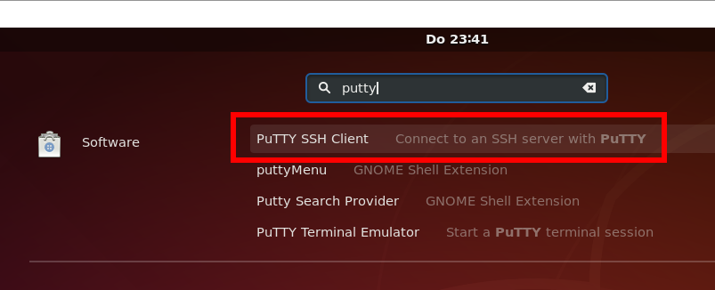

# Serial Communication Between Windows and Ubuntu

If you don't have a physical device attached to your Windows host system (typically COM3), you can simulate a serial device like this:

Install Null-modem emulator com0com <a href="https://sourceforge.net/projects/com0com/"> (sourceforge.net)</a>

Create a new COM3 port like this


Type mode into windows command.

```
mode
```

The new COM3 port appears


If you select "use Ports class" on Null-modem emulator the port shows up even on the "Device Manager". However it works also without.


Use for example PuTTY to open port COM3X <a href="https://putty.org/">(putty.org)</a>. Characters entered into COM3X are sent to COM3 by Null-modem emulator.


Now we have a fully functional COM3 port to which we can read and write (with PuTTY)

## Ubuntu

Install PuTTY like this:


